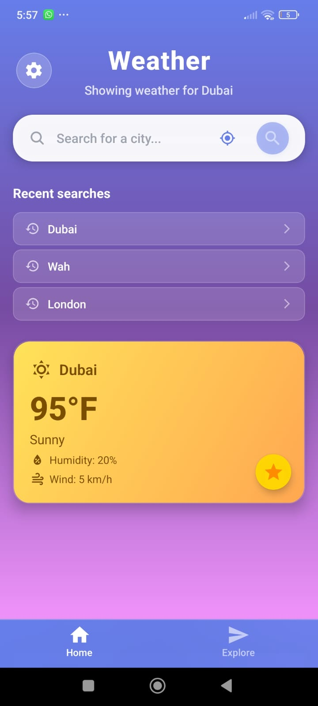
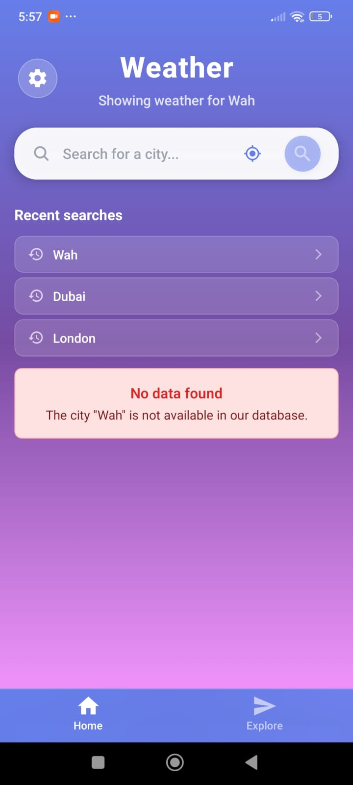
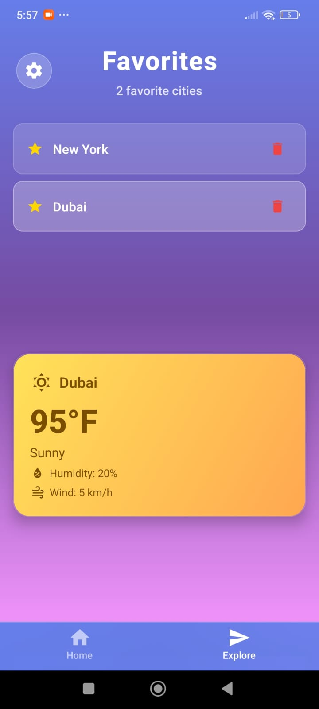
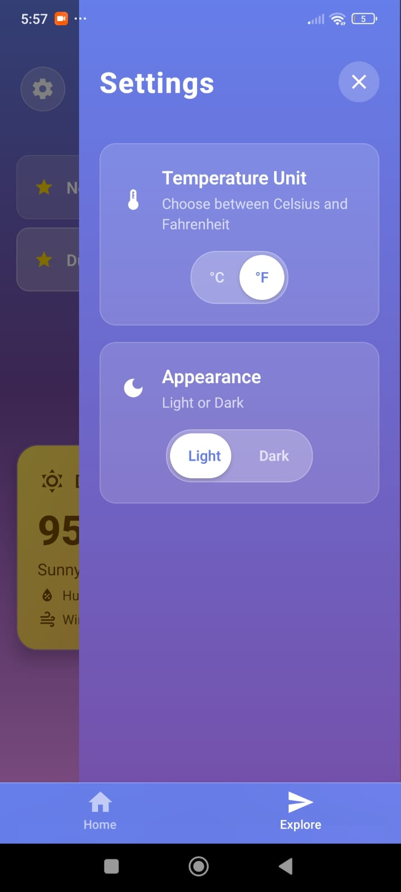

## Weather App – Implementation Guide

This React Native app (Expo + Expo Router) implements a responsive weather experience with local JSON data, offline caching, favorites, temperature unit toggle, and time-based light/dark theming.

### Quick start

- **Install**
  ```bash
  npm install
  ```
- **Start app**
  ```bash
  npm run start
  ```
- **Run local JSON API** (JSON Server)
  ```bash
  npm run serve:data
  ```
  Uses `data/weatherData.json` at `http://localhost:3000` (example: `GET /weatherData?city=London`).

### Project structure (high-level)

- Screens: `app/(tabs)/index.jsx`, `app/(tabs)/explore.jsx`
- Core UI: `components/WeatherDisplay.jsx`, `components/WeatherCard.jsx`, `components/RecentSearchList.jsx`, `components/SettingsDrawer.jsx`
- State: `context/TemperatureContext.js`, `context/ThemeContext.js`
- Data/API: `data/weatherData.json`, `services/weatherService.js`, `utils/storage.js`
- Navigation: `app/(tabs)/_layout.jsx`, `app/_layout.jsx`

---

## How each requirement is implemented

### 1) City Search & Weather Display

- **Local JSON via JSON Server**: `data/weatherData.json`
- **Fetch layer** (simulates API): `services/weatherService.js`
- **Search UI & actions**: `app/(tabs)/index.jsx`
- **Display with loading/error/offline states**: `components/WeatherDisplay.jsx`
- **Weather card styles/icons by condition**: `components/WeatherCard.jsx`

What happens

- User searches a city in `index.jsx` → calls `fetchWeatherByCity` → shows result in `WeatherDisplay.jsx`.
- JSON Server serves the JSON file for search queries.

### 2) Faster Recent Searches (Persistent)

- **Persistence**: `utils/storage.js` (`getRecentSearches`, `addRecentSearch`)
- **Rendering**: `components/RecentSearchList.jsx` (optimized list + subtle animations)
- **Usage**: wired in `app/(tabs)/index.jsx` (initial load, tap to re-fill search & fetch)

### 3) Temperature Unit Toggle (°C/°F)

- **Global state**: `context/TemperatureContext.js` (unit + converter)
- **UI control**: `components/SettingsDrawer.jsx` (animated segmented toggle)
- **Conversion**: `components/WeatherCard.jsx` calls `convertTemperature`

### 4) Favorite Cities

- **Persistence**: `utils/storage.js` (`getFavorites`, `addFavorite`, `removeFavorite`)
- **Mark as favorite**: `components/FavoriteButton.jsx`
- **Favorites screen**: `app/(tabs)/explore.jsx` (lists, select for details, remove)

### 5) UI Enhancements (weather-based styles)

- **Dynamic themes by condition** (Sunny/Cloudy/Rainy…): `components/WeatherCard.jsx`
- **Modern UI details**: gradients, rounded cards, shadows across components

### 6) Offline Mode & Caching

- **Cache last successful result**: `utils/storage.js` (`getLastSearch`, `setLastSearch`)
- **Network awareness**: `components/WeatherDisplay.jsx` (NetInfo + fallbacks)
- **Data fetching**: React Query (`@tanstack/react-query`) in `WeatherDisplay.jsx`

### 7) Current Location (Recommended)

- **Location permission + reverse geocode**: `app/(tabs)/index.jsx` (via `expo-location`)
- If a valid city is detected, it’s searched and stored in recents.

### 8) Bonus – what’s covered

- **Animations**: `react-native-reanimated` used in `SettingsDrawer.jsx`, `RecentSearchList.jsx`, `WeatherCard.jsx`, and screen sections in `index.jsx` / `explore.jsx`.
- Pull-to-refresh / background sync: not implemented.

---

## Theming & Responsiveness

- **Light/Dark mode (time-based initial default)**: `context/ThemeContext.js` (persisted; toggle in `SettingsDrawer.jsx`)
- **Responsive sizing**: `Dimensions`-aware styles in `components/WeatherCard.jsx`, `components/RecentSearchList.jsx`, and screen paddings in `app/(tabs)/index.jsx` and `app/(tabs)/explore.jsx`.

---

## Commands

- **Start app**
  ```bash
  npm run start
  ```
- **Run local JSON API**
  ```bash
  npm run serve:data
  ```

---

## Demo video

Add your demo link here:

`https://drive.google.com/file/d/1aB8izadDCKPnu8JgrnTLc8zDANaoyQvX/view?usp=sharing`

---

## Screenshots

Below are a few screens from the app (more can be added as needed):

| Home                                       | Search                                       | Favorites                                       | Settings                                       |
| ------------------------------------------ | -------------------------------------------- | ----------------------------------------------- | ---------------------------------------------- |
|  |  |  |  |
